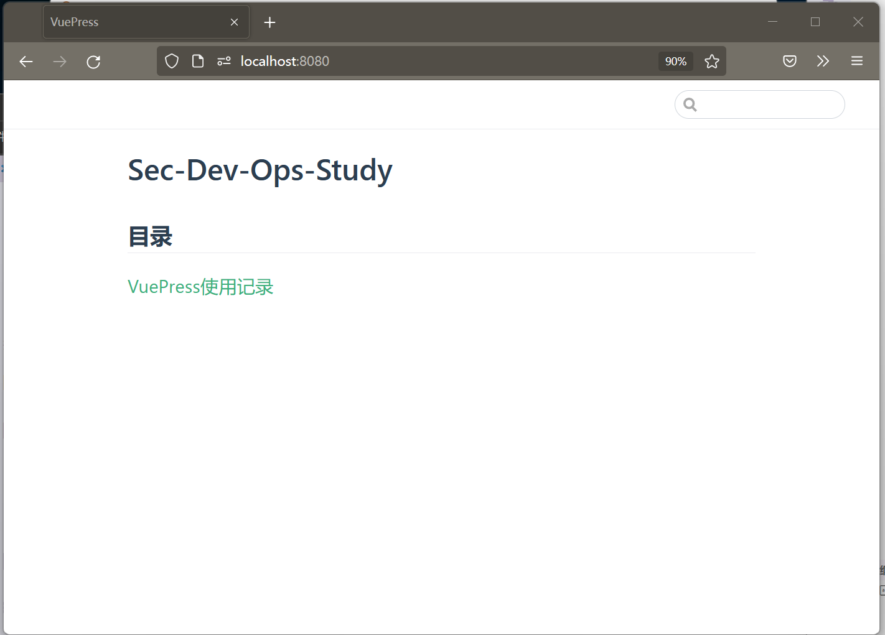

<!--
 * @Version: 0.1
 * @Autor: zmf96
 * @Email: zmf96@qq.com
 * @Date: 2022-02-19 05:42:52
 * @LastEditors: zmf96
 * @LastEditTime: 2022-02-19 06:07:36
 * @FilePath: /docs/vuepress.md
 * @Description: 
-->

# VuePress 笔记


## 快速入门

[https://vuepress.vuejs.org/zh/guide/getting-started.html](https://vuepress.vuejs.org/zh/guide/getting-started.html)

```bash
mkdir sec-dev-ops-study
cd sec-dev-ops-study

➜ yarn init
yarn init v1.22.17
question name (sec-dev-ops-study): sec-dev-ops-study
question version (1.0.0): 0.1.0
question description: 这是一个安全开发运维工程师(打杂工程师)的学习笔记.
question entry point (index.js): 
question repository url: https://nuc.local:3000/zmf96/sec-dev-ops-study.git
question author: zmf96
question license (MIT): 
question private: 
success Saved package.json
Done in 66.28s.

yarn add -D vuepress

mkdir docs
touch docs/README.md
```
```
cat package.json
{
  "name": "sec-dev-ops-study",
  "version": "0.1.0",
  "description": "这是一个安全开发运维工程师(打杂工程师)的学习笔记.",
  "main": "index.js",
  "repository": "https://nuc.local:3000/zmf96/sec-dev-ops-study.git",
  "author": "zmf96",
  "license": "",
  "devDependencies": {
    "vuepress": "^1.9.7"
  },
  "scripts": {
    "docs:dev": "vuepress dev docs",
    "docs:build": "vuepress build docs"
  }
}
```
```bash
yarn run docs:dev
```
然后访问`http://localhost:8080/`




## 部署到GitHub Pages

[https://vuepress.vuejs.org/zh/guide/deploy.html#github-pages](https://vuepress.vuejs.org/zh/guide/deploy.html#github-pages)